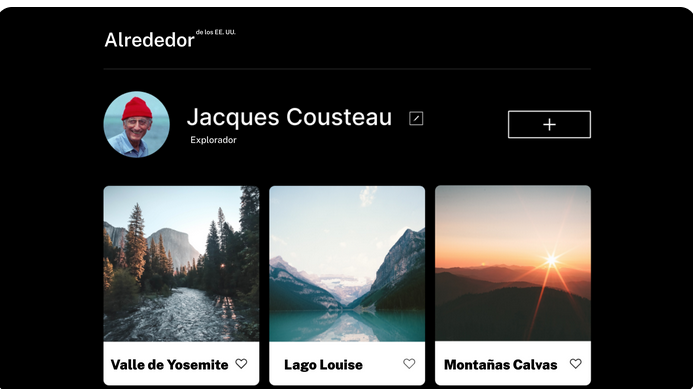
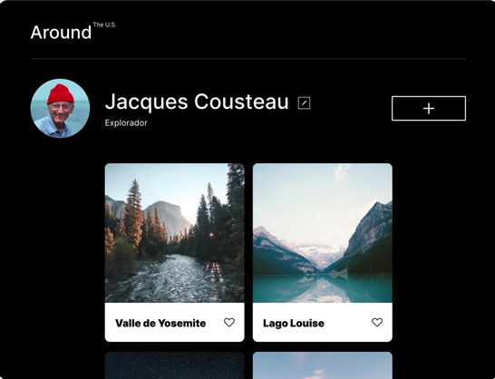
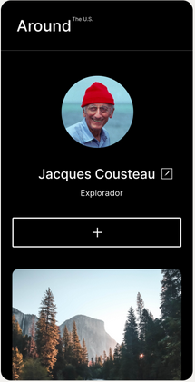
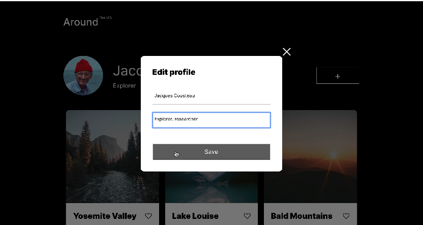
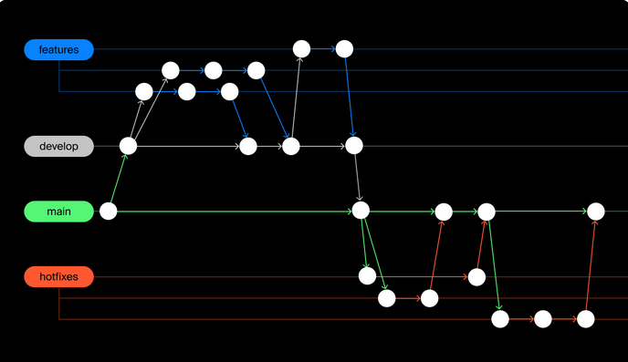

# Tripleten web_project_around

# Primera parte

## De que trata?

### Se realizará una página interactiva acerca de algunos estados pertenecientes a USA, al mismo tiempo, los usuarios que deseen acceder a la al sitio web podrán añadir, eliminar o dar like a las fotos.

## Imágen del proyecto en la siguientes resoluciones:

1. 1280px

2. 800px

3. 320px

## ¿Que novedades se agregarán?

### Este será el primer proyecto que se le implementará Javascript, como muestra de ello se va a programar un cuadro de alerta, el cuál contendrá el nombre, apellidos que se buscan agregar y un botón de guardar. Lo más importante de esto, es que los datos guardados si se reflejen en la página.

## Imágen del cuadro de alerta:

### Por otra parte, se trabajará con ramas git de una manera más profesional, conformado por el siguiente esquema:

1. ### La rama Features representá cada parte del sitio web, es decir se crearán ramas por separadas, por ejemplo feature/header representá el encabezado.

2. ### La rama Develop es la rama principal de trabajo, dentro de ella se fusionarán las ramas features con el fin de ver posibles errores y depuraciones. Todo esto antes de fusiinarla con la rama main.

3. ### Las ramas Hotfix se utilizán para temas de corrección de errores, por ejemplo el header esta incompleto se crea una rama hotfix/header, y una vez subsanados los errores se fusiona posteriormente con main y se borra.

## Link GitHub Pages:

#
