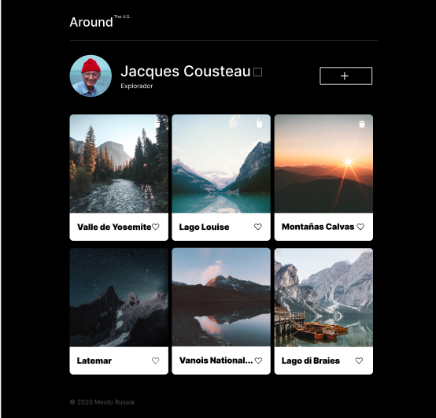
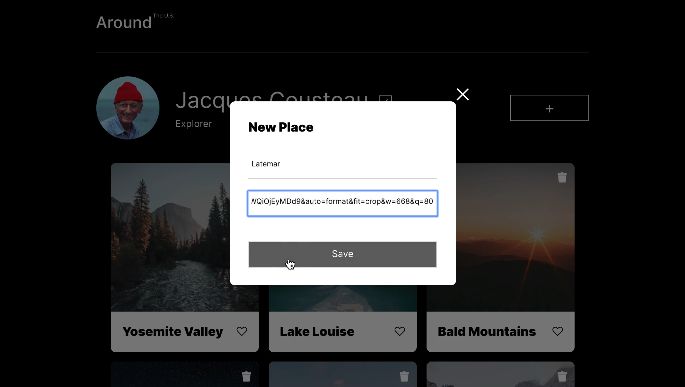
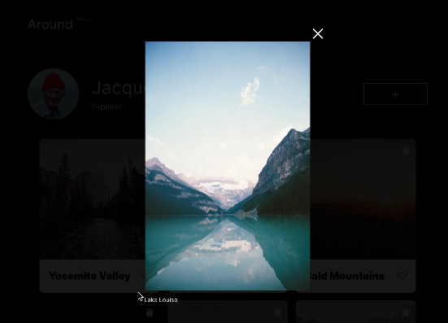
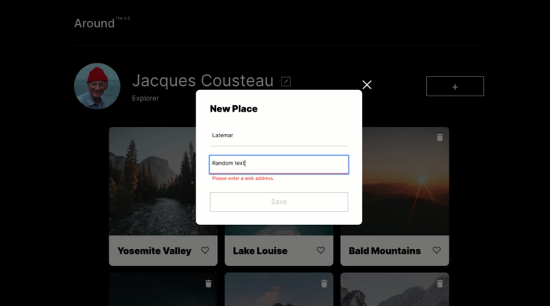
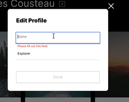
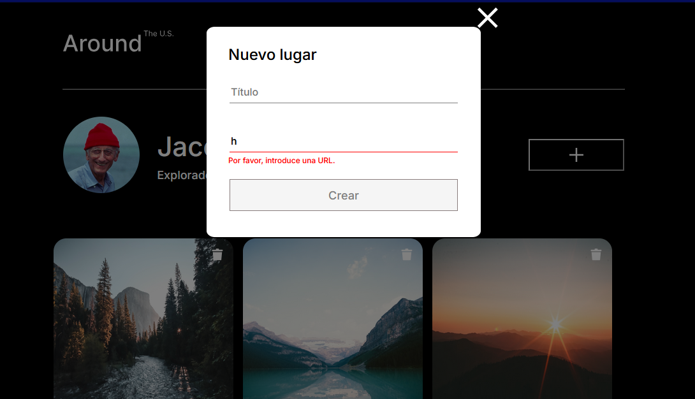
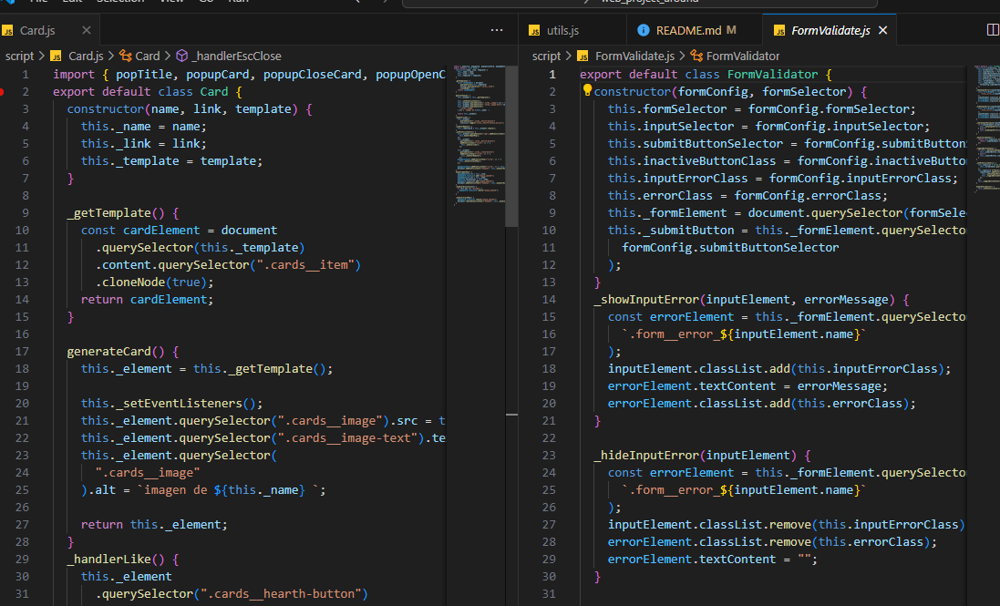

# Tripleten web_project_around

# Primera parte

## De que trata?

### Se realizará una página interactiva acerca de algunos estados pertenecientes a USA, al mismo tiempo, los usuarios que deseen acceder a la al sitio web podrán añadir, eliminar o dar like a las fotos.

## El proyecto se adaptara en las siguientes resoluciones:

1. 1280px

2. 800px

3. 320px

## Imágen del Proyecto:

## ¿Que novedades se agregarán?

### Este será el primer proyecto que se le implementará Javascript, como muestra de ello se va a programar un cuadro de alerta, el cuál contendrá el nombre, apellidos que se buscan agregar y un botón de guardar. Lo más importante de esto, es que los datos guardados si se reflejen en la página.

### Por otra parte, se trabajará con ramas git de una manera más profesional, conformado por el siguiente manera:

1. ### La rama Features representá cada parte del sitio web, es decir se crearán ramas por separadas, por ejemplo feature/header representá el encabezado.

2. ### La rama Develop es la rama principal de trabajo, dentro de ella se fusionarán las ramas features con el fin de ver posibles errores y depuraciones. Todo esto antes de fusiinarla con la rama main.

3. ### Las ramas Hotfix se utilizán para temas de corrección de errores, por ejemplo el header esta incompleto se crea una rama hotfix/header, y una vez subsanados los errores se fusiona posteriormente con main y se borra.

## Cosas aprendidas:

- ### Darle funcionalidad al modificador de los botones para cambiarlos a color negro.

- ### Darle funcionalidad al modificador de la sección que contiene el fomrulario, para al momento de hacer click en el boton aeditar cambien el fondo de la página a un color negro semistransparente.

- ### Programar mediante variables, funciones y addEventListeners, cada componente del formulario para que pueda cerrarse, abrirse y agregar información nueva para que aparezca en la página (sección profile).

- ### Mejorar el diseño responsivo agregando más medidas en las consultas de medios.

# Segunda Parte

## Cuales son las siguientes novedades?

- ### Agregar un nuevo formulario que contendrá las funcionalidades necesarias para agregar, remover(se agregá funcionalidad al icono de trash) o cambiar el orden de estas mismas.

- ## #Al seleccionar una imágen, esta deberá aparecer de manera emergente, es decir, al hacer click dicha imágen se agarandará junto a su respectivo nombre y se ajustara su tamaño dependiendo la resolución del dispositivo.

## Imágenes con la funcionalidades mencionadas con anterioridad:

## Cosas que se aprendierón en esta parte:

- ### Entender más la lógica de los arrays en cuanto al uso de sus objetos y propiedades.

- ### Utilizar la etiqueta template y nodos para realizar diversas funciones que permitieron agregar funcionalidad a las imágenes(crear, eliminar).

- ### Como solucionar conflictos entre ramas, es decir, intencionalmente se creo un error y con ayuda de VSCODE se pudo solucionar dicho conflicto.

## Tercera parte

## Se aprendio los siguente:

### Validar los formularios mediante mensajes de errores, y que su respectivo boton quedará inhabilitado si alguno de las entradas estaban incompletas.

### Cerrar los formularios e imágenes mediante la tecla "Esc".

### Cerrar los formularios e imágenes al momento de hacer click afuera de ellos.

### Reiniciar el botón de cada formulario para que vuelva a estar desactivado, sino se hace ningun cambio en los campos de entrada.

## Imágenes de lo que se aprendió en esta parte:

## Cuarta Parte:

### Se implemento el uso de POO para crear las clases Card y FromValidator

### En esta etapa se refactorizo el código, y se dividio en modulos(export e import)

## Imágen del proyecto funcionando con todo lo implementado anteriormente:

### Link GitHub Pages:

## https://melomario57.github.io/web_project_around/index.html
